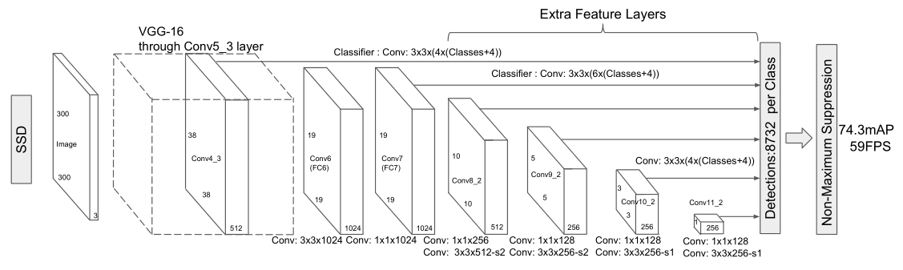
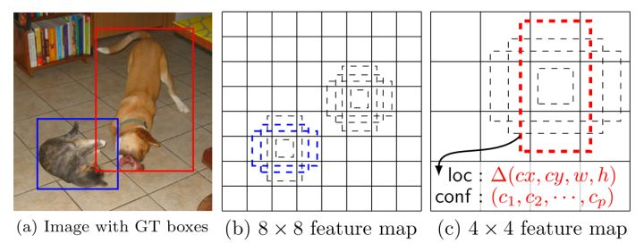

读过SSD源码后，这里主要总结3点：
- 网络结构
- 与网络结构匹配的label
- loss的计算

# 网络结构


这里用了6个feature map 来预测物体的`种类`和`位置`。这6个feature map的大小分别为\[(38, 38), (19, 19), (10, 10), (5, 5), (3, 3), (1, 1)\]。在这里只挑出一个feature map(38×38)来说明，其它类似。tensorflow的源代码如下：
``` python
def ssd_multibox_layer(inputs,
                       num_classes,
                       sizes,
                       ratios=[1],
                       normalization=-1,
                       bn_normalization=False):
    """Construct a multibox layer, return a class and localization predictions.
    """
    net = inputs
    if normalization > 0:
        net = custom_layers.l2_normalization(net, scaling=True)
    # Number of anchors.
    num_anchors = len(sizes) + len(ratios)

    # Location.
    num_loc_pred = num_anchors * 4
    loc_pred = slim.conv2d(net, num_loc_pred, [3, 3], activation_fn=None,
                           scope='conv_loc')
    loc_pred = custom_layers.channel_to_last(loc_pred)
    loc_pred = tf.reshape(loc_pred,
                          tensor_shape(loc_pred, 4)[:-1]+[num_anchors, 4])
    # Class prediction.
    num_cls_pred = num_anchors * num_classes
    cls_pred = slim.conv2d(net, num_cls_pred, [3, 3], activation_fn=None,
                           scope='conv_cls')
    cls_pred = custom_layers.channel_to_last(cls_pred)
    cls_pred = tf.reshape(cls_pred,
                          tensor_shape(cls_pred, 4)[:-1]+[num_anchors, num_classes])
return cls_pred, loc_pred
```
其中input就为feature map。
- shape为\[B,38,38,512]
- sizes = \[21., 45.]
- ratios = \[2, .5]
- num_anchors = 4

由feature map 经过卷积得到对**位置偏移的预测**和**类别的预测**
- 位置偏移:
```
    num_loc_pred = num_anchors * 4
    loc_pred = slim.conv2d(net, num_loc_pred, [3, 3], activation_fn=None,
                           scope='conv_loc')
```
- 类别:
```
    num_cls_pred = num_anchors * num_classes
    cls_pred = slim.conv2d(net, num_cls_pred, [3, 3], activation_fn=None,
                           scope='conv_cls')
```
再经过reshape后，返回的cls_pred.shape = \[B,38,38,4,num_classes],loc_pred.shape = \[B,38,38,4,4]。这样就完成了对38×38这个尺度上的default box类别和框的偏移量的预测。下图可以帮助理解这个过程

## 网络结构总结：
SSD用6个feature map分别对一张图的物体进行识别。这多个尺度下的散布的default box可以对不同尺度、不同位置的物体进行识别。有效的解决了检测任务经常遇见的两个问题：scale、location

# 与网络结构匹配的label
有了网络结构后，就需要设定label来训练它。对应规则为：
- 对于每一个GT框而言，计算与所有default box的IOU，大于阈值则将这些default box的标签按此GT框来设定。当然如果之前某个default box已经被分配了，那就还需要此GT框与此default box的IOU大于之前的IOU才能被分配。
代码如下：

重要的几点：
- tf_ssd_bboxes_encode_layer为计算一层feature map的label（位置和类别）
- labels，bboxs为一张图片中所有物体的label和box
- jaccard_with_anchors函数为：计算一个物体的box与所有default box的IOU，shape为：\[38,38,4]。
- condition 函数为判断是否所有的物体已经循环完了
- body 函数为将一个GT框分配给所有符合要求的default box
- tf.while_loop为对所有GT框进行循环。
- 经过分配之后，计算default box与GT框之间的差作为localization的label
```python
#label和bbox编码函数
def tf_ssd_bboxes_encode_layer(labels,#ground truth标签，1D tensor
                               bboxes,#N×4 Tensor（float）
                               anchors_layer,#anchors，为list
                               matching_threshold=0.5,#阀值
                               prior_scaling=[0.1, 0.1, 0.2, 0.2],#缩放
                               dtype=tf.float32):
    """Encode groundtruth labels and bounding boxes using SSD anchors from
    one layer.

    Arguments:
      labels: 1D Tensor(int64) containing groundtruth labels;
      bboxes: Nx4 Tensor(float) with bboxes relative coordinates;
      anchors_layer: Numpy array with layer anchors;
      matching_threshold: Threshold for positive match with groundtruth bboxes;
      prior_scaling: Scaling of encoded coordinates.

    Return:
      (target_labels, target_localizations, target_scores): Target Tensors.
    """
    # Anchors coordinates and volume.
    #获取anchors层
    yref, xref, href, wref = anchors_layer
    ymin = yref - href / 2.
    xmin = xref - wref / 2.
    ymax = yref + href / 2.
    xmax = xref + wref / 2.
    #xmax的shape为((38, 38, 1), (38, 38, 1), (4,), (4,))
(38, 38, 4)
    #体积
    vol_anchors = (xmax - xmin) * (ymax - ymin)

    # Initialize tensors...
    shape = (yref.shape[0], yref.shape[1], href.size)
    feat_labels = tf.zeros(shape, dtype=tf.int64)
    feat_scores = tf.zeros(shape, dtype=dtype)
    #shape为（38,38,4）
    feat_ymin = tf.zeros(shape, dtype=dtype)
    feat_xmin = tf.zeros(shape, dtype=dtype)
    feat_ymax = tf.ones(shape, dtype=dtype)
    feat_xmax = tf.ones(shape, dtype=dtype)

    #计算jaccard重合
    def jaccard_with_anchors(bbox):
        """Compute jaccard score a box and the anchors.
        """
        # Intersection bbox and volume.
        int_ymin = tf.maximum(ymin, bbox[0])
        int_xmin = tf.maximum(xmin, bbox[1])
        int_ymax = tf.minimum(ymax, bbox[2])
        int_xmax = tf.minimum(xmax, bbox[3])
        h = tf.maximum(int_ymax - int_ymin, 0.)
        w = tf.maximum(int_xmax - int_xmin, 0.)

        # Volumes.
        inter_vol = h * w
        union_vol = vol_anchors - inter_vol \
            + (bbox[2] - bbox[0]) * (bbox[3] - bbox[1])
        jaccard = tf.div(inter_vol, union_vol)
        return jaccard
    #条件函数 
    def condition(i, feat_labels, feat_scores,
                  feat_ymin, feat_xmin, feat_ymax, feat_xmax):
        """Condition: check label index.
        """
        #tf.less函数 Returns the truth value of (x < y) element-wise.
        r = tf.less(i, tf.shape(labels))
        return r[0]
    #主体
    def body(i, feat_labels, feat_scores,
             feat_ymin, feat_xmin, feat_ymax, feat_xmax):
        """Body: update feature labels, scores and bboxes.
        Follow the original SSD paper for that purpose:
          - assign values when jaccard > 0.5;
          - only update if beat the score of other bboxes.
        """
        # Jaccard score.
        label = labels[i]
        bbox = bboxes[i]
        scores = jaccard_with_anchors(bbox)#计算jaccard重合值

        # 'Boolean' mask.
        #tf.greater函数返回大于的布尔值
        mask = tf.logical_and(tf.greater(scores, matching_threshold),
                              tf.greater(scores, feat_scores))
        imask = tf.cast(mask, tf.int64)
        fmask = tf.cast(mask, dtype)
        # Update values using mask.
        feat_labels = imask * label + (1 - imask) * feat_labels
        feat_scores = tf.select(mask, scores, feat_scores)

        feat_ymin = fmask * bbox[0] + (1 - fmask) * feat_ymin
        feat_xmin = fmask * bbox[1] + (1 - fmask) * feat_xmin
        feat_ymax = fmask * bbox[2] + (1 - fmask) * feat_ymax
        feat_xmax = fmask * bbox[3] + (1 - fmask) * feat_xmax
        return [i+1, feat_labels, feat_scores,
                feat_ymin, feat_xmin, feat_ymax, feat_xmax]
    # Main loop definition.
    i = 0
    [i, feat_labels, feat_scores,
     feat_ymin, feat_xmin,
     feat_ymax, feat_xmax] = tf.while_loop(condition, body,
                                           [i, feat_labels, feat_scores,
                                            feat_ymin, feat_xmin,
                                            feat_ymax, feat_xmax])
   
    # Transform to center / size.
    #计算补偿后的中心
    feat_cy = (feat_ymax + feat_ymin) / 2.
    feat_cx = (feat_xmax + feat_xmin) / 2.
    feat_h = feat_ymax - feat_ymin
    feat_w = feat_xmax - feat_xmin
    # Encode features.
    feat_cy = (feat_cy - yref) / href / prior_scaling[0]
    feat_cx = (feat_cx - xref) / wref / prior_scaling[1]
    feat_h = tf.log(feat_h / href) / prior_scaling[2]
    feat_w = tf.log(feat_w / wref) / prior_scaling[3]
    # Use SSD ordering: x / y / w / h instead of ours.
    feat_localizations = tf.stack([feat_cx, feat_cy, feat_w, feat_h], axis=-1)
    return feat_labels, feat_localizations, feat_scores


#ground truth编码函数
def tf_ssd_bboxes_encode(labels,#ground truth标签，1D tensor
                         bboxes,#N×4 Tensor（float）
                         anchors,#anchors，为list
                         matching_threshold=0.5,#阀值
                         prior_scaling=[0.1, 0.1, 0.2, 0.2],#缩放
                         dtype=tf.float32,
                         scope='ssd_bboxes_encode'):
    """Encode groundtruth labels and bounding boxes using SSD net anchors.
    Encoding boxes for all feature layers.

    Arguments:
      labels: 1D Tensor(int64) containing groundtruth labels;
      bboxes: Nx4 Tensor(float) with bboxes relative coordinates;
      anchors: List of Numpy array with layer anchors;
      matching_threshold: Threshold for positive match with groundtruth bboxes;
      prior_scaling: Scaling of encoded coordinates.

    Return:
      (target_labels, target_localizations, target_scores):
        Each element is a list of target Tensors.
    """
    with tf.name_scope(scope):
        target_labels = []
        target_localizations = []
        target_scores = []
        for i, anchors_layer in enumerate(anchors):
            with tf.name_scope('bboxes_encode_block_%i' % i):
                #将label和bbox进行编码
                t_labels, t_loc, t_scores = \
                    tf_ssd_bboxes_encode_layer(labels, bboxes, anchors_layer,
                                               matching_threshold, prior_scaling, dtype)
                target_labels.append(t_labels)
                target_localizations.append(t_loc)
                target_scores.append(t_scores)
        return target_labels, target_localizations, target_scores


#编码goundtruth的label和bbox
    def bboxes_encode(self, labels, bboxes, anchors,
                      scope='ssd_bboxes_encode'):
        """Encode labels and bounding boxes.
        """
        return ssd_common.tf_ssd_bboxes_encode(
            labels, bboxes, anchors,
            matching_threshold=0.5,
            prior_scaling=self.params.prior_scaling,
            scope=scope)
```

# loss的计算
计算loss需要下列成分：
- logits：6个分数预测
- locations：6个位置预测
- gclasses： 类别标签
- glocations：位置标签
- gscores：mask用于标定哪些default box被分配了真实框
- negative_ratio：负样本/正样本
- match_threshold: 分配阈值（IOU大于此阈值的default box才被分配真实框）
```python
    def losses(self, logits, localisations,
               gclasses, glocalisations, gscores,
               match_threshold=0.5,
               negative_ratio=3.,
               alpha=1.,
               label_smoothing=0.,
               scope='ssd_losses'):
        """Define the SSD network losses.
        """
        return ssd_losses(logits, localisations,
                          gclasses, glocalisations, gscores,
                          match_threshold=match_threshold,
                          negative_ratio=negative_ratio,
                          alpha=alpha,
                          label_smoothing=label_smoothing,
                          scope=scope)

```
计算loss的过程如下：
- 1.先将所有的多维向量变换成1维。如logits为一个长度为6的list，而每个元素又是一个\[batch_size,w,h,num_anchor,num_class]的tensor。我们将其展开为一个\[N,num_class]的tensor。这一步是为了方便计算。
- 2.计算正样本的mask，由之前传入的gscores可以直接计算得到。
- 3.计算负样本的mask，并进行hard negative mining。简单来说就是负样本太多会导致loss被负样本主导，我们需要选取出其中一些有难度的负样本来计算loss。
    * 3.1用正样本的mask计算出负样本的mask
    * 3.2计算出负样本应该有的数量(1.本来有的数量，2.由正样本的数量和negative_ratio计算出的数量。计算1、2的最小值就为负样本应有的数量)num_neg
    * 3.3 然后根据logits计算出为背景框的概率，选取概率最小的前num_neg个负样本为真正要计算loss的负样本。（概率最小表示模型觉得为非背景，但是它就是背景）
- 4. 有了pmask和nmask之后，就可以开始计算loss了，这里计算两类loss：1.类别 2.localization
    * 4.1 类别的loss正负样本都需要计算
    * 4.2 localization的loss只有正样本才需要计算。
```python
def ssd_losses(logits, localisations,
               gclasses, glocalisations, gscores,
               match_threshold=0.5,
               negative_ratio=3.,
               alpha=1.,
               label_smoothing=0.,
               device='/cpu:0',
               scope=None):
    with tf.name_scope(scope, 'ssd_losses'):
        lshape = tfe.get_shape(logits[0], 5)
        num_classes = lshape[-1]
        batch_size = lshape[0]

        # Flatten out all vectors!
        flogits = []
        fgclasses = []
        fgscores = []
        flocalisations = []
        fglocalisations = []
        for i in range(len(logits)):
            flogits.append(tf.reshape(logits[i], [-1, num_classes]))
            fgclasses.append(tf.reshape(gclasses[i], [-1]))
            fgscores.append(tf.reshape(gscores[i], [-1]))
            flocalisations.append(tf.reshape(localisations[i], [-1, 4]))
            fglocalisations.append(tf.reshape(glocalisations[i], [-1, 4]))
        # And concat the crap!
        logits = tf.concat(flogits, axis=0)
        gclasses = tf.concat(fgclasses, axis=0)
        gscores = tf.concat(fgscores, axis=0)
        localisations = tf.concat(flocalisations, axis=0)
        glocalisations = tf.concat(fglocalisations, axis=0)
        dtype = logits.dtype

        # Compute positive matching mask...
        pmask = gscores > match_threshold
        fpmask = tf.cast(pmask, dtype)
        n_positives = tf.reduce_sum(fpmask)

        # Hard negative mining...
        no_classes = tf.cast(pmask, tf.int32)
        predictions = slim.softmax(logits)
        nmask = tf.logical_and(tf.logical_not(pmask),
                               gscores > -0.5)
        fnmask = tf.cast(nmask, dtype)
        nvalues = tf.where(nmask,
                           predictions[:, 0],
                           1. - fnmask)
        nvalues_flat = tf.reshape(nvalues, [-1])
        # Number of negative entries to select.
        max_neg_entries = tf.cast(tf.reduce_sum(fnmask), tf.int32)
        n_neg = tf.cast(negative_ratio * n_positives, tf.int32) + batch_size
        n_neg = tf.minimum(n_neg, max_neg_entries)

        val, idxes = tf.nn.top_k(-nvalues_flat, k=n_neg)
        max_hard_pred = -val[-1]
        # Final negative mask.
        nmask = tf.logical_and(nmask, nvalues < max_hard_pred)
        fnmask = tf.cast(nmask, dtype)

        # Add cross-entropy loss.
        with tf.name_scope('cross_entropy_pos'):
            loss = tf.nn.sparse_softmax_cross_entropy_with_logits(logits=logits,
                                                                  labels=gclasses)
            loss = tf.div(tf.reduce_sum(loss * fpmask), batch_size, name='value')
            tf.losses.add_loss(loss)

        with tf.name_scope('cross_entropy_neg'):
            loss = tf.nn.sparse_softmax_cross_entropy_with_logits(logits=logits,
                                                                  labels=no_classes)
            loss = tf.div(tf.reduce_sum(loss * fnmask), batch_size, name='value')
            tf.losses.add_loss(loss)

        # Add localization loss: smooth L1, L2, ...
        with tf.name_scope('localization'):
            # Weights Tensor: positive mask + random negative.
            weights = tf.expand_dims(alpha * fpmask, axis=-1)
            loss = custom_layers.abs_smooth(localisations - glocalisations)
            loss = tf.div(tf.reduce_sum(loss * weights), batch_size, name='value')
tf.losses.add_loss(loss)
```
