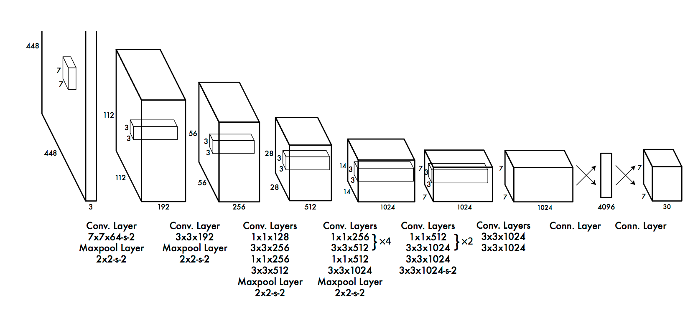
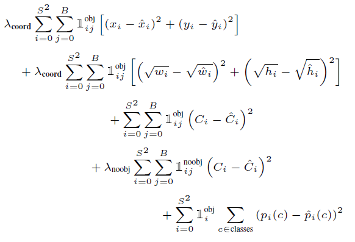

在这里介绍yolo_v1检测网络，主要分为三个部分介绍：
- 1.网络结构
- 2.训练
- 3.测试
- [tensorflow代码链接](https://github.com/hizhangp/yolo_tensorflow)
## 网络结构
yolo检测器的思想为将检测问题看成一个回归问题，即框的位置和类别都直接预测得出。网络输出三个部分的预测：1）框的位置，2）类别的分布，3）是否有物体的概率。网络结构如下图：

最后的输出为7×7×30,将整个图像划分为7×7的网格来识别，在每个网格内，给出两个预测框，每个预测框有四个位置和一个是否有物体的概率。所以30=（20+2*（1+4））=(num_class+num_box*(is_object+box_coord))

## 训练
GT（ground truth）框的中心落在7×7的哪个网格内，则这个网格就负责预测这个GT框。label的制作代码如下:
```python
label = np.zeros((self.cell_size, self.cell_size, 25))
for obj in objs:
    bbox = obj.find('bndbox')
    # Make pixel indexes 0-based
    x1 = max(min((float(bbox.find('xmin').text) - 1) * w_ratio, self.image_size - 1), 0)
    y1 = max(min((float(bbox.find('ymin').text) - 1) * h_ratio, self.image_size - 1), 0)
    x2 = max(min((float(bbox.find('xmax').text) - 1) * w_ratio, self.image_size - 1), 0)
    y2 = max(min((float(bbox.find('ymax').text) - 1) * h_ratio, self.image_size - 1), 0)
    cls_ind = self.class_to_ind[obj.find('name').text.lower().strip()]
    boxes = [(x2 + x1) / 2.0, (y2 + y1) / 2.0, x2 - x1, y2 - y1]
    x_ind = int(boxes[0] * self.cell_size / self.image_size) #GT框中心落在网格的横坐标
    y_ind = int(boxes[1] * self.cell_size / self.image_size) #GT框中心落在网格的纵坐标
    if label[y_ind, x_ind, 0] == 1:
        continue
    label[y_ind, x_ind, 0] = 1 #是否有物体的概率
    label[y_ind, x_ind, 1:5] = boxes #GT框的坐标（xo,yo,w,h），0~1
    label[y_ind, x_ind, 5 + cls_ind] = 1 #类别标签
```

### loss
loss计算公式如下：



注意两点：
- 预测的xo,yo坐标为网格内的相对位置。
- 预测的w,h为真实的w,h的平方根。
变换的代码如下：
```python
boxes_tran = tf.stack(
    [boxes[..., 0] * self.cell_size - offset,
     boxes[..., 1] * self.cell_size - offset_tran,
     tf.sqrt(boxes[..., 2]),
     tf.sqrt(boxes[..., 3])], axis=-1)
```
有物体的mask的代码如下：
```python
iou_predict_truth = self.calc_iou(predict_boxes_tran, boxes)

# calculate I tensor [BATCH_SIZE, CELL_SIZE, CELL_SIZE, BOXES_PER_CELL]
object_mask = tf.reduce_max(iou_predict_truth, 3, keep_dims=True)
object_mask = tf.cast(
    (iou_predict_truth >= object_mask), tf.float32) * response
```
## 测试
预测过程是对7×7×30的tensor进行处理。先将class和scales相乘，得到框中含有不同物体的分布，再卡阈值得到一些存在物体的框，再通过NMS得到最后的结果。代码如下：
```python
for i in range(self.boxes_per_cell):
            for j in range(self.num_class):
                probs[:, :, i, j] = np.multiply(
                    class_probs[:, :, j], scales[:, :, i])

filter_mat_probs = np.array(probs >= self.threshold, dtype='bool')
filter_mat_boxes = np.nonzero(filter_mat_probs)
boxes_filtered = boxes[filter_mat_boxes[0],
                       filter_mat_boxes[1], filter_mat_boxes[2]]
probs_filtered = probs[filter_mat_probs]
classes_num_filtered = np.argmax(
    filter_mat_probs, axis=3)[
    filter_mat_boxes[0], filter_mat_boxes[1], filter_mat_boxes[2]]

argsort = np.array(np.argsort(probs_filtered))[::-1]
boxes_filtered = boxes_filtered[argsort]
probs_filtered = probs_filtered[argsort]
classes_num_filtered = classes_num_filtered[argsort]

for i in range(len(boxes_filtered)):
    if probs_filtered[i] == 0:
        continue
    for j in range(i + 1, len(boxes_filtered)):
        if self.iou(boxes_filtered[i], boxes_filtered[j]) > self.iou_threshold:
            probs_filtered[j] = 0.0

filter_iou = np.array(probs_filtered > 0.0, dtype='bool')
boxes_filtered = boxes_filtered[filter_iou]
probs_filtered = probs_filtered[filter_iou]
classes_num_filtered = classes_num_filtered[filter_iou]
```


